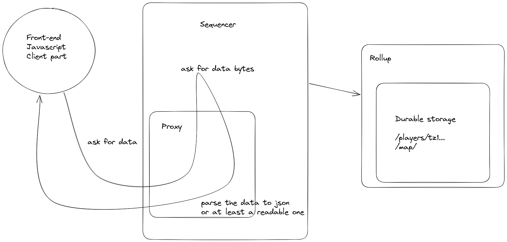

# Todo

- display the gold
- display the marketplace
- a button next to the inventory to sell the item
- a button inside the marketplace to buy an item

# Implementation of the market place

1. adding a field to players: `gold`, default value: 1000 (usize)
2. "/market-place/{player-address}/{item-id}"
   - sword: 01
   - potion: 02
3. The value stored in the "/market-place/{player-address}/{item-id}/value" is the price
4. Add action to add an item to the market place:

```rust
enum PlayerAction {
   ...
   Sell(ItemId, Price) // Sell(usize, usize)
   Buy(PlayerAddress, ItemId)
}
```

# Generating the map randomly

1. Create a map with walls everywhere
2. Then add some floors

```rust
let x, y = 16, 16; // The middle of the map
for j in 100
   for i in 100:
      add_floor(x, y);
      let delta_x = random(0, 1);
      let delta_y = random(0, 1);
      let item_sword = random(0, 500);
      let item_potion = random(0, 250);
      if item_sword == 0 {
         add_item(Sword);
      }
      if item_potion == 0 {
         add_item(Potion);
      }
      x, y = x + delta_x, y + delta_y;
```

# Modify Item as a list

# next pair

- preparing the demo to have the game running into two different computers
- marketplace + withdraw on L1
- proxy
- next step is to use the verification(wallet)

## Next potential features

1. Bind buttons (or function) to the arrow keys of the keyboard (React App) (done)
2. Display items inside the inventory (done)
3. Add walls: fix wall inside map (wip, add wall inside the new)
4. Later Add more information for item:
   1. kind of items: portion, weapon (done)
   2. function for portion (player can have level)
5. Map editor: convert string -> map? (with this we can have many kind of maps)

## Connect to wallet

Simplify version in kernel (not production ready but nice for demo with multiplayers game):

- Remove signature verification so there will be no verification.
- Player address (address), player action (address, action).

1. One player per address (done)
   - /state/player/x_pos => /state/players/{tz1...}/player/x_pos
   - /state/player/x_pos => /state/players/{tz1...}/inventory/ (wip)
2. Exchanges/transfer
   - Player should be able to exhange items between each others
     2.1 "drop_item" => removes from the inventory and add the item on the floor
     2.2 Exchange an interface where the player (state machine) selling items: into marketplace
     2.3 switching items
     - p1 open a trade with p2
     - p1 add an item
     - p1 validate what he is offering
     - p2 add an item
     - p1 valid the offer
     - the trade is done

## Randomness

BIG-STEP: Difficult but very nice to achive this

Random for rollup, chasing monster.

## Proxy

It's not convenient to parse bytes from the browser. So instead we can ask to a proxy server to deserialize the data for us. It will convert bytes into json.

Then it means the proxy server has to know the binary encoding of the durable storage, that's why the proxy should be written in Rust.

Fortunately the sequencer can also act as a proxy server as explained in the following picture:



In term of code, it means to define one http endpoint by "component", like so:

```rust
async fn get_player<N: Node>(node: web::Data<N>) -> impl Responder {
    //let x_pos = node.as_ref().get_value("/players/tz1..../x_pos").await;
    //let y_pos = node.as_ref().get_value("/players/tz1..../y_pos").await;
    //let inventory = node.as_ref().get_value("/players/tz1..../inventory").await;
    let res: Option<Vec<u8>> = Some(vec![]);
    match res {
        Some(bytes) => {
             // Parsing all the fields from bytes to rust type

             // create the player
            let player = Player {
               x_pos,
               y_pos,
               inventory
            }

            // Serialize it to json
            let json = serde_json::to_string(&player).unwrap();
            // return the json
            json
        }
        None => "not ok".to_string(),
    }
}
```

The first would be to copy paste the sequencer-http to the dungeon folder.
